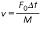

### Theory

**A. Background:**

This is experiment is about response of a single degree of freedom (SDOF) system subjected to excition which is non-periodic (aperiodic) but deterministic with respect to time. The type of excitation seen in Experiment No. 2 is periodic and moreover, harmonic or sinusoidal. Such type of excitation has a fixed amplitude and a particular frequency. Mathematically, its value, as a function of time, t, is expressed by the expression f(t)=F0 sin(wt), where, F0 is the amplitude and w is the frequency of the force excitation. In case of support excitation (Experiment No 3 ), it is . Such kind of excitation is observed in case of machine running at constant speed and having a rotating unbalance.

However, many times, the excitation is non-periodic or aperiodic, and, of course, non-sinusoidal. It may be applied suddenly and for a very short time but having a large value or it may have a moderate value but applied suddenly and for a finite period of time. Or, It may be applied for a short duration but with gradual increase in its value, starting with zero; And there are many more such possibilities. The excitation can be a force excitation or a support excitation having variation with respect to time as stated above. The force (or motion of the support) may vary continuously though it is aperiodic but following some relationship with time (i.e. it is deterministic in nature) and is called an arbitrary forcing function. The study of response of a single degree of freedom system (SDOF System) to such a force or support excitation is the basis of this experiment.

An impulse is a large force, F0, acting for a very short interval of time, &Delta;t. It is measured by the product F0*&Delta;t = I. Response of SDOF system to an impulse is obtained easily. It follows the principle of conservation of momentum and response of SDOF system to initial velocity. If the mass of the system is initially at rest, its momentum, immediately after the application of impulsive force, is obtained from I = Mv-Mu. Where M is the mass, u is initial velocity, v is velocity immediately after the application of the impulse, and I is the impulse, I = F0*&Delta;t. If initial velocity u is zero (i.e. if the mass is at rest, initially), the velocity of the mass, immediately after application of impulse, is obtained as

This can be considered as the initial velocity given to the system and the response of the system is written as

If damping is very small, and hence neglected, we write and get the response of undamped SDOF system to impulse as

The symbols carry their usual meanings as explained in earlier experiments and also given on the next page.
Consider a SDOF system falling from a height 'h' on the ground with support touching the ground first. The motion of the mass can also be considered to be with initial velocity but a sudden and continuous force equal to weight of the mass acting on it after the hit.
The response is given by

 The first term in the above expression is due to initial velocity V0 given by V0 =(2gh)0.5, where h is the height through which the system falls down and the support hits the ground.

The second term is due to the fact that the weight of the mass, Mg, starts acting on the mass suddenly and continuously after the support hits the ground.

In case of an undamped system with &zeta; =0, the above expression reduces to\
M = Mass of system idealised as rigid lump mass,\
K = Stiffness of spring; the spring represents the resilient material or component present in actual, real-life system, like a cork sheet, rubber support, etc.\
C = Damping coefficient of damping material present in the system; the resilient materials themselves mentioned above provide the damping\
&omega;n = Undamped natural frequency = (K/M)0.5\
Cc = Critical damping coefficient =2(KM)0.5\
&zeta; = damping coefficient factor = C/Cc ; whose value is considered to be less than 1 as the system is under-damped\
&omega;d = Damped natural frequency = (1-&zeta; 2) &omega;n

**B. About The Experiment:**

The experiment considers motion of body of a car after falling into a ditch of depth 'h' or after passing over a hump of a selected shape. The car-body is modelled as a single rigid lumped mass supported over the axle through the suspension (shock absorber). The suspension is represented by the spring and the viscous damper. The motion of the body of the car is obtained using expression given earlier and shown in the simulator. The motion is also shown graphically as a function of time. There is facility to select the values of different parameters and dimensions of either the ditch or hump. This is an example of support excitation of SDOF which is aperiodic but deterministic. By aperiodic, we mean, not repeating after a fixed interval of time, and by deterministic, we mean its value can be obtained exactly for any given value of time.The animation of car showing same concept is given below;